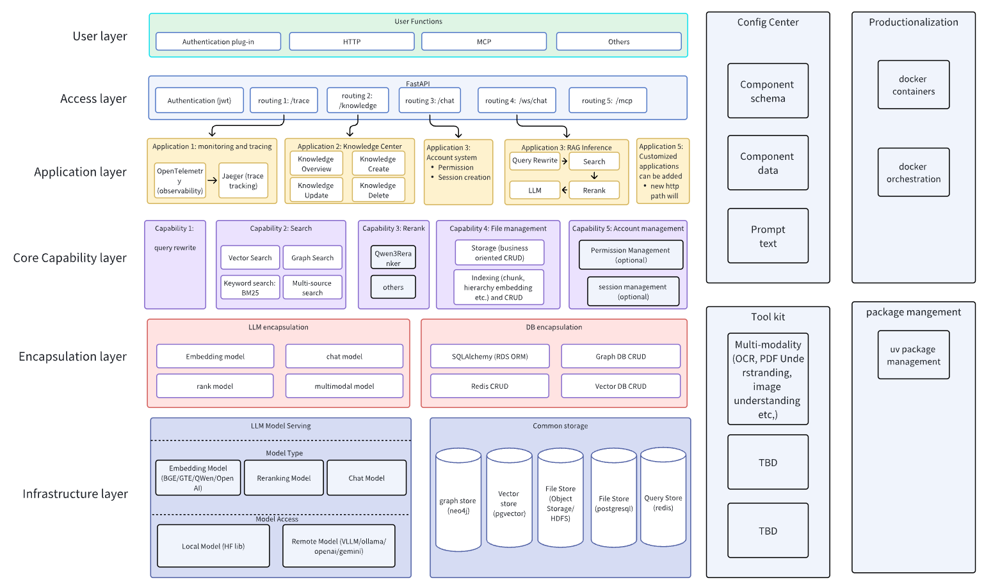
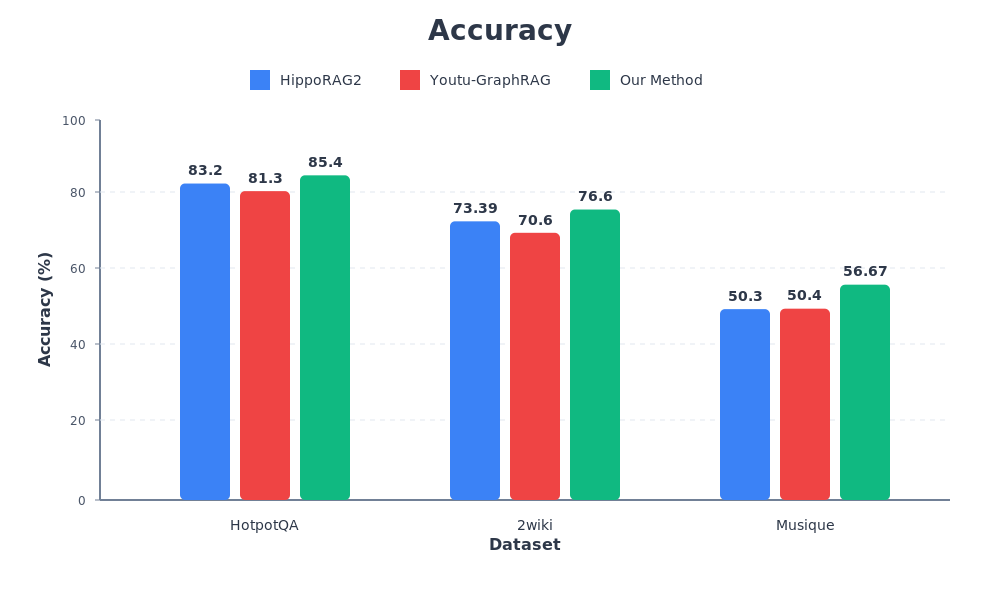
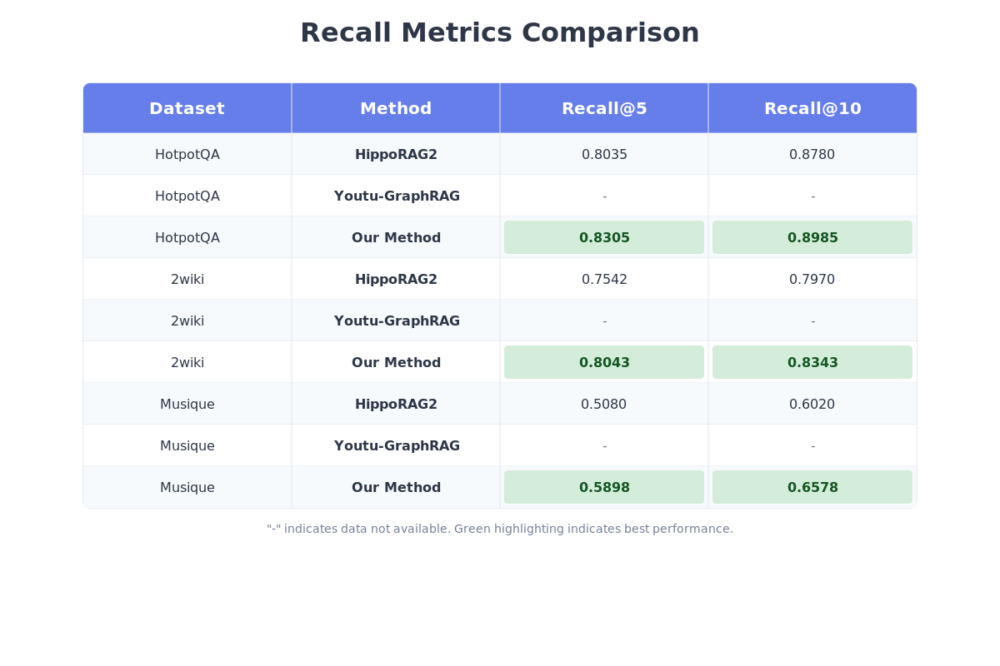
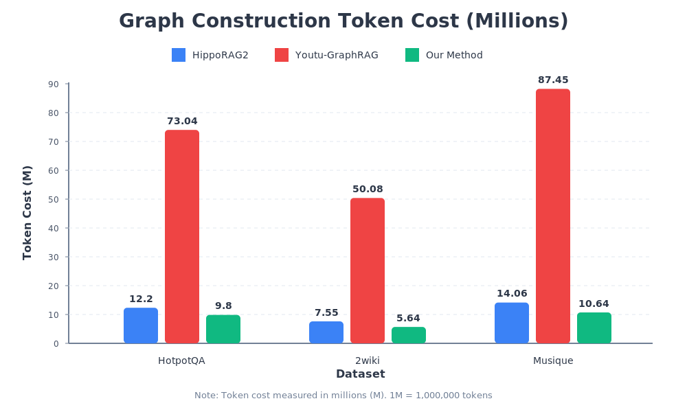

<div align="center">

# 🧠 RAG-ARC：检索增强生成架构

[](LICENSE)
[](https://www.python.org/downloads/)
[](https://fastapi.tiangolo.com/)
[](https://github.com/facebookresearch/faiss)
[](https://docs.pydantic.dev/)

*一个模块化、高性能的检索增强生成框架，支持多路径检索、图结构提取和融合排序*

[📘 English](README.md) • [⭐ 核心特性](#核心特性) • [🏗️ 架构](#架构) • [🚀 快速开始](#快速开始)

</div>

## 🎯 项目概述

**RAG-ARC** 是一个模块化的检索增强生成（RAG）框架，旨在构建高效、可扩展的架构，支持多路径检索、图结构提取和融合排序。该系统解决了传统RAG系统在处理非结构化文档（PDF、PPT、Excel等）时的关键挑战，如信息丢失、检索准确率低和多模态内容识别困难等问题。

### 🎯 核心应用场景

🧩 **RAG 全流程支持**：
覆盖从文档解析、文本分块、向量化，到多路径检索、图结构提取、结果重排序与知识图谱管理的完整流程，实现端到端的智能检索增强生成。

📚 **知识密集型任务**：
适用于依赖大量结构化与非结构化知识的问答、推理与内容生成场景，确保高召回率与语义一致性。

🌐 **多场景适配**：
同时支持 **标准 RAG** 与 **GraphRAG** 模式，可灵活应用于学术论文分析、个人知识库、企业知识库等多种领域，配置灵活、部署简便。

## 🏗️ 架构

<div align="center">
<br>
RAG-ARC 系统架构概览
</div>

## 🔧 核心特性

**RAG-ARC** 融合了多项关键创新，构建出一个高效、可扩展、精密集成的检索增强生成（RAG）框架：

### 📁 多格式文档解析

* 支持多种文件类型：**DOCX、PDF、PPT、Excel、HTML** 等
* 灵活解析策略：支持 **OCR** 与 **布局感知的 PDF 解析**（基于 `dots_ocr` 模块）
* 同时具备 **原生 OCR** 与 **基于多模态大模型（VLM）的 OCR 能力**

### ✂️ 文本分块与向量化

* 支持多种分块策略：按 **Token**、**语义**、**递归规则** 或 **Markdown 层级**
* 集成 **HuggingFace 嵌入模型** 生成高质量向量表示
* 分块大小与重叠比例 **可灵活配置**

### 🔍 多路径检索

* 集成 **BM25（稀疏检索）**、**Dense（Faiss-GPU）** 与 **Tantivy 全文搜索**
* 采用 **倒数排名融合（RRF）** 实现多通道结果合并
* 支持 **自定义权重与融合策略**，实现检索优化

### 🌐 图结构提取

* 基于事实的 **实体与关系抽取**，构建结构化知识图谱
* 与 **Neo4j 图数据库** 无缝集成
* 支持面向问答与推理的知识图谱管理

### 🧠 GraphRAG

* 采用简洁高效的建图方式，**支持增量更新**，便于企业级部署
* 引入 **子图 PPR（Personalized PageRank）**：相比 HippoRAG2 在全图范围内的 PPR 计算，子图 PPR 实现了 **更精准的定位与更高的推理效率**

### 📈 重排序（Rerank）

* 基于 **Qwen3 模型** 的高精度结果重排序
* 支持 **LLM 驱动** 与 **列表式策略** 的双模式重排序
* 结合 **分数归一化与元数据增强** 提升排序鲁棒性

### 🧩 模块化架构

* **工厂模式** 管理 LLM、嵌入与检索器组件创建
* **分层设计**：`config`、`core`、`encapsulation`、`application`、`api`
* **单例模式** 管理分词器与数据库连接
* **共享机制** 支持检索器与嵌入模型实例复用，提高系统性能

## 📊 性能表现

基于 **HippoRAG2** 的架构演进，**RAG-ARC** 在成本效率与召回性能方面均实现了显著突破：

* 🚀 **Token 成本降低 22.9%**
  通过精心设计的提示词策略，在保持精度的同时有效减少 Token 消耗

* 🎯 **召回率提升 5.3%**
  借助剪枝优化，显著提高了文档检索的全面性与相关性

* 🔁 **支持知识图谱的增量更新**
  无需重新构图即可更新图谱，大幅降低计算与维护成本

<div align="center">
  <h3>📊 性能对比</h3>
  <br>
  <br>
  
</div>

## 📁 项目结构

```
RAG-ARC/
├── 📁 api/                       # API层（FastAPI路由/MCP集成）
│   ├── routers/                  # API路由定义
│   ├── config_examples/          # 配置示例
│   └── mcp/                      # MCP服务器实现
│
├── 📁 application/               # 业务逻辑层
│   ├── rag_inference/            # RAG推理模块
│   ├── knowledge/                # 知识管理
│   └── account/                  # 用户账户管理
│
├── 📁 core/                      # 核心能力
│   ├── file_management/          # 文件解析和分块
│   ├── retrieval/                # 检索策略
│   ├── rerank/                   # 重排序算法
│   ├── query_rewrite/            # 查询重写
│   └── prompts/                  # 提示模板
│
├── 📁 config/                    # 配置系统
│   ├── application/              # 应用配置
│   ├── core/                     # 核心模块配置
│   └── encapsulation/            # 封装配置
│
├── 📁 encapsulation/             # 封装层
│   ├── database/                 # 数据库接口
│   ├── llm/                      # LLM接口
│   └── data_model/               # 数据模型和模式
│
├── 📁 framework/                 # 框架核心
│   ├── module.py                 # 基础模块类
│   ├── register.py               # 组件注册表
│   └── config.py                 # 配置系统
│
├── 📁 test/                      # 测试套件
│
├── main.py                      # 🎯 主应用程序入口点
├── app_registration.py          # 组件初始化
├── pyproject.toml               # 项目依赖
└── README.md                    # 项目文档
```

## 🚀 快速开始

### 🐳 Docker部署（推荐）

**三步部署：**

```bash
# 1. 克隆仓库
git clone https://github.com/DataArcTech/RAG-ARC.git
cd RAG-ARC

# 2. 构建Docker镜像（一次性设置）
./build.sh

# 3. 启动所有服务
./start.sh
```

部署包含以下服务：
- ✅ **PostgreSQL 16**：元数据存储
- ✅ **Redis 7**：缓存层
- ✅ **Neo4j**：知识图谱数据库
- ✅ **RAG-ARC应用**：支持GPU的FastAPI应用

**脚本功能说明：**

`build.sh`：
- 检查Docker环境
- 创建.env配置文件
- 选择CPU/GPU模式（自动检测NVIDIA GPU）
- 拉取基础镜像（PostgreSQL、Redis、Neo4j）
- 构建RAG-ARC应用镜像

`start.sh`：
- 创建Docker网络
- 启动全部4个容器
- 等待服务就绪
- 验证部署状态

`stop.sh`：
- 停止所有运行中的容器（保留数据）

`cleanup.sh`：
- 删除所有容器和Docker卷
- 删除Docker网络
- **保留本地数据目录**（`./data`、`./local`、`./models`）
- 适用于清理Docker资源但保留数据的情况

`clean-docker-data.sh`：
- 删除RAG-ARC容器和Docker卷
- **删除RAG-ARC应用镜像**（rag_arc:v1, rag_arc:v1-gpu）
- **同时删除本地数据目录**（`./data/postgresql`、`./data/neo4j`、`./data/redis`、`./data/graph_index_neo4j`）
- **⚠️ 安全提示：只会删除RAG-ARC相关的资源（容器、卷、镜像），不会删除系统上所有的Docker资源**
- **ℹ️ 基础镜像（PostgreSQL、Redis、Neo4j）会被保留**，因为它们可能被其他项目使用
- 适用于需要完全清理的情况（⚠️ **这将删除所有数据！**）

**访问服务：**
- API服务：http://localhost:8000
- API文档：http://localhost:8000/docs

📖 **详细说明和故障排除请参见 [Docker部署指南（中文）](README.Docker-CN.md) 或 [Docker Deployment Guide (English)](README.Docker.md)**

### 💻 本地安装

> 配置 `.env` 可参考 [env-en.md](env-en.md)（英文）或 [env-zh.md](env-zh.md)（中文）。

```bash
# 1. 克隆仓库
git clone https://github.com/DataArcTech/RAG-ARC.git
cd RAG-ARC

# 2. 安装uv（如果尚未安装）
# 推荐：使用国内镜像（国内更快）
curl -LsSf https://astral.ac.cn/uv/install.sh | sh
# 备选：使用官方安装器
# curl -LsSf https://astral.sh/uv/install.sh | sh
# 或添加到PATH：export PATH="$HOME/.local/bin:$PATH"

# 3. 安装依赖（uv会自动创建虚拟环境）
uv sync

# 可选：安装开发依赖（用于运行测试）
uv sync --extra dev

# 4. 复制并配置环境变量
cp .env.example .env
# 根据 env-zh.md 填写模型/API Key，其余保持默认即可
```

### 🔐 可选：管理员视角

部分管理型 API（如导出所有租户的图数据）需要管理员身份才能调用。启用方法：

1. 创建或挑选一个用户作为超级管理员。
2. 在环境变量或 `.env` 中设置 `ADMIN_OWNER_ID=<该用户的UUID>`，例如：
   ```bash
   export ADMIN_OWNER_ID=00000000-0000-0000-0000-00000000ABCD
   ```
3. 重启 FastAPI 服务，使配置生效。

完成后，使用该管理员账号发起请求即可在 `/rag_inference/chat`、`/rag_inference/graph_overview` 等接口中传入 `include_all_owners=true` 或 `target_owner_id=<UUID>`，实现跨租户的数据巡检；普通用户依旧只能访问自己的数据。

> 管理员请求会先执行完整的 multipath 流程（dense/BM25 在 `owner_id=None` 下可访问所有 chunk），若全部检索器仍返回空结果，再自动回退到图检索以输出全局子图。

#### 🧪 集成测试相关环境变量

某些测试需要真实数据库、Redis 或 Faiss/Qwen 模型支撑，可在 `.env` 中按需设置以下开关：

| 变量 | 作用 |
| --- | --- |
| `RUN_RAGARC_INTEGRATION_TESTS=1` | 启用依赖 GPU/大模型的综合测试，例如 NetworkX 图流程、OCR、用户隔离 E2E。 |
| `RUN_RAGARC_POSTGRES_TESTS=1` | 允许执行 PostgreSQL 集成测试（`test/encapsulation/database/relational_db`）。 |
| `RUN_RAGARC_CHAT_STORAGE_TESTS=1` | 打开同时访问 PostgreSQL + Redis 的聊天存储测试。 |
| `RUN_RAGARC_VECTOR_TESTS=1` | 启用 Faiss/Qwen 软删除相关测试。 |
| `RAGARC_E2E_TOKEN=<JWT>` | 提供给 `test/test_complete_e2e_api.py` 用的 Bearer Token，用于调用 FastAPI 接口。 |

默认留空（或 0）即跳过这些测试；只有在对应服务已经部署并且希望运行完整集成用例时，才需要设置为 `1`。

### ⚙️ 配置

RAG-ARC使用模块化配置系统。关键配置文件位于`config/json_configs/`,在这里，你可以控制选择每个模型使用的显卡，业务流程中使用的模型等不同的参数：

- `rag_inference.json`：RAG检索配置
- `knowledge.json`：知识管理配置
- `account.json`：用户账户配置
- `.env`：运行时参数（模型、账号、端口等）。当需要在本地直接访问容器中的 PostgreSQL / Redis / Neo4j 时，可设置 `DEVELOP_MODE=true`（等同于开启 `EXPOSE_*` 变量），上述服务会开放到 `localhost`；默认关闭以确保安全。
- `DEEPSEARCH_EXTERNAL_SEARCH_ENABLED`（位于 `.env`，默认 `false`）：保持关闭即可让 DeepSearch 只依赖图谱检索；若需要在 Gap Detection 判定覆盖不足时自动调用 Tavily Web 搜索，请设置为 `true` 并提供 `TAVILY_API_KEY`。

### 🌐 通过 `.env` 切换模型调用方式

每个模型都可以单独选择“OpenAI API”或“本地模型”，在 `.env` 中配置即可：

| 组件 | API 模式示例 | 本地模式示例 |
| --- | --- | --- |
| Chat | `CHAT_MODEL_PROVIDER=openai`<br>`CHAT_MODEL_NAME=gpt-4o-mini`<br>`CHAT_API_KEY=sk-...`<br>`CHAT_API_BASE_URL=https://api.openai.com/v1` | `CHAT_MODEL_PROVIDER=huggingface`<br>`CHAT_MODEL_NAME=Qwen/Qwen2.5-7B`<br>`cache_folder=./models/Qwen`（按需设置） |
| Embedding | `EMBEDDING_MODEL_PROVIDER=openai`<br>`OPENAI_EMBEDDING_MODEL=text-embedding-3-large`<br>`EMBEDDING_API_KEY=sk-...` | `EMBEDDING_MODEL_PROVIDER=huggingface`<br>`EMBEDDING_MODEL_NAME=Qwen/Qwen3-Embedding-0.6B`<br>`cache_folder=./models/Qwen` |
| OCR | `OCR_MODEL_PROVIDER=openai`<br>`OPENAI_OCR_MODEL=gpt-4o`<br>`OCR_API_KEY=sk-...` | `OCR_MODEL_PROVIDER=vllm` 或 `dots_ocr_parser`，提前把模型放在 `./models/dots_ocr` |
| Reranker | API 模式默认使用基于 Chat LLM 的 listwise reranker（共用 `CHAT_MODEL_PROVIDER`），无需额外配置 | 本地模式下 `rag_inference_local.json` 会加载 `Qwen/Qwen3-Reranker-0.6B`（通过 `RERANKER_MODEL_NAME`、`RERANKER_CACHE_FOLDER` 指定，模型需预先下载到 `./models/Qwen`） |

如果想进一步自定义流程，可在 `.env` 中设置 `RAG_INFERENCE_CONFIG_PATH`、`KNOWLEDGE_CONFIG_PATH` 指向你自己的 JSON 文件。

如需直接切换官方提供的两套配置，可设置 `MODEL_PROFILE=api` 或 `MODEL_PROFILE=local`（或自行指定配置文件路径）。

**⚠️ 重要提示：使用Docker部署时**，如果更改了模型提供商（例如从`openai`切换到`huggingface`，或更改`MODEL_PROFILE`），您**必须重新构建Docker镜像**才能应用更改：
```bash
./build.sh  # 使用新的.env设置重新构建
./start.sh  # 重启服务
```

### 📦 预下载本地模型

**⚠️ 本地模式所需**：只有在 `MODEL_PROFILE=local` 或显式将嵌入提供商切换为 HuggingFace 时，才需要下载；默认 API 模式使用 OpenAI 嵌入，可跳过此步骤。

运行本地模式前，可先下载对应的 HuggingFace 模型，以避免 Docker 里以 root 身份下载：

```bash
# 下载本地模式所需的全部模型（embedding/reranker/minilm）
uv run python download_models.py

# 或下载特定组件
uv run python download_models.py --components embedding reranker minilm
```

脚本会把权重放在 `./models/Qwen`、`./models/dots_ocr` 和 `./models/all-MiniLM-L6-v2`。脚本开头提供了 `HF_ENDPOINT` 的注释示例，如需使用国内镜像（如 https://hf-mirror.com ），取消注释即可。

### 🏃 运行服务

```bash
# 启动FastAPI服务器（uv run会自动管理虚拟环境）
uv run uvicorn main:app --host 0.0.0.0 --port 8000 --reload
```

### 🖥️ CLI 调试（跳过 HTTP 层）

需要快速验证算法时，可直接通过命令行驱动整个 RAG 流程，而无需启动 FastAPI：

```bash
# 在本地文件夹中批量导入/索引/建图
uv run rag-arc ingest-folder ./example/docs --owner-id 00000000-0000-0000-0000-000000000000

# 查看已导入文件及状态（JSON 输出）
uv run rag-arc list-files --owner-id 00000000-0000-0000-0000-000000000000 --json

# 对已有文件重新触发索引
uv run rag-arc trigger-index FILE_ID1 FILE_ID2

# 完整聊天链路（包含 LLM）
uv run rag-arc chat "什么是RAG-ARC？"

# 仅通过图检索问答（默认输出子图信息）
uv run rag-arc graph-qa "X 和 Y 之间有什么关系？" --json

# 仅检查检索/重排，导出子图并打印 JSON
uv run rag-arc pipeline "什么是RAG-ARC？" --skip-llm --subgraph --json

# 导出完整图谱到 JSON 文件
uv run rag-arc export-graph --output graph.json
```

CLI 仍会连接 `.env` 中配置的 PostgreSQL / Redis / Neo4j / MinIO 等基础服务，因此虽然不用启动 `rag-arc-app` 容器，但这些依赖必须保持可用。

> ⚠️ 删除提示：`uv run rag-arc delete-file FILE_ID` **仅会把文件状态标记为 `DELETED`**，方便本地快速验证检索隔离，不会执行索引、向量库、图谱或 Blob 的真正清理。若需完整的后台删除流程，请调用 HTTP API `DELETE /knowledge/{file_id}`；CLI 不再支持触发全量清理。

#### DeepSearch MCP 工具服务器

- 通过 `uv run rag-arc tool-mcp-server --transport stdio` 启动 FastMCP 服务器，向上游智能体暴露 DeepSearch 内置工具。服务默认读取 `config/json_configs/deepsearch_tool_mcp_server.json`（可用 `DEEPSEARCH_TOOL_MCP_CONFIG_PATH` 覆盖），从而与 HTTP/CLI 入口共用相同的 LLM 和图适配器配置。
- **ToolManager 默认直接在本地进程中执行所有内建工具**，只有当配置了 `mcp_client`、在某个工具上设置 `mcp_only/mcp_fallback`，或通过 `remote_tools` 注册外部描述符时，才会把调用通过 MCP server 转发出去。因此 MCP 服务器不是必需组件，仅在需要远程托管/复用工具时才需要提前启动。
- JSON 配置中的 `tool_manager` 字段遵循 `config/application/deepsearch_config.py` 的同一结构，可在此关闭/调整单个工具或注入远程 MCP 描述符，避免重复粘贴环境变量。
- 需要只暴露部分工具时设置 `DEEPSEARCH_TOOL_MCP_TOOLS`（逗号分隔）；留空则默认启用全部内建工具。
- HTTP、CLI、MCP 的 DeepSearch/Chat 响应现在都会输出统一的 `evidence` 字段（chunk、三元组、种子实体、图统计）。HTTP 端通过 `include_evidence=true`（可配合 `return_subgraph=true`）启用，CLI 使用 `--with-evidence`，MCP 接口默认携带该信息。
- 可通过 `ENABLE_ALL_EVIDENCE`、`CHAT_TOP_CHUNKS`、`CHAT_TOP_TRIPLES`、`CHAT_TOP_SEED_ENTITIES`、`DEEPSEARCH_TOP_CHUNKS`、`DEEPSEARCH_TOP_TRIPLES` 等环境变量限制证据负载大小；开启 `ENABLE_ALL_EVIDENCE=true` 时不再截断。

#### Chat MCP 服务器

- 通过 `uv run rag-arc chat-mcp-server --transport stdio` 将带鉴权的聊天流程（会话创建 + chat 调用）以 MCP 方式暴露，具体实现在 `api/mcp/server.py` 中。
- 若切换到 SSE/HTTP 传输，默认监听 `127.0.0.1:8785`，URL 前缀为 `mcp/chat`，因此不会与工具 MCP 服务器（8765）占用同一端口。
- 当需要让外部代理通过 MCP 直接驱动 RAG-ARC 聊天能力时，可使用该入口而无需额外的 HTTP/WS 适配层。

> 📚 更详细的命令说明（单文件导入、文件管理、触发索引、图导出等）见 `cli/README-CN.md`。

### 🧪 使用示例

```bash
# 上传文档
curl -X POST "http://localhost:8000/knowledge" \
  -H "Authorization: Bearer YOUR_ACCESS_TOKEN" \
  -F "file=@/path/to/your/document.pdf"

# 与RAG系统对话
curl -X POST "http://localhost:8000/rag_inference/chat" \
  -H "Authorization: Bearer YOUR_ACCESS_TOKEN" \
  -H "Content-Type: application/json" \
  -d '{"query": "什么是RAG-ARC?"}'

# 请求证据包（chunks/三元组/种子实体/子图）
curl -X POST "http://localhost:8000/rag_inference/chat" \
  -H "Authorization: Bearer YOUR_ACCESS_TOKEN" \
  -H "Content-Type: application/json" \
  -d '{"query": "什么是RAG-ARC?", "return_subgraph": true, "include_evidence": true}'

# DeepSearch 报告 + 证据
curl -X POST "http://localhost:8000/deepsearch/run" \
  -H "Authorization: Bearer YOUR_ACCESS_TOKEN" \
  -H "Content-Type: application/json" \
  -d '{"question": "什么是RAG-ARC?", "include_evidence": true}'

# 获取Token（登录）
curl -X POST "http://localhost:8000/auth/token" \
  -H "Content-Type: application/x-www-form-urlencoded" \
  -d "username=YOUR_USERNAME&password=YOUR_PASSWORD"

# 注册新用户
curl -X POST "http://localhost:8000/auth/register" \
  -H "Content-Type: application/json" \
  -d '{"name": "新用户", "user_name": "YOUR_USERNAME", "password": "YOUR_PASSWORD"}'

# 创建新对话会话
curl -X POST "http://localhost:8000/session" \
  -H "Authorization: Bearer YOUR_ACCESS_TOKEN"

# 列出会话内消息
curl -X GET "http://localhost:8000/session/YOUR_SESSION_ID/messages" \
  -H "Authorization: Bearer YOUR_ACCESS_TOKEN"
```

### SSE 流式对话（Python 示例）：

```python
import json
import httpx

def chat_sse(session_id: str, access_token: str):
    url = f"http://localhost:8000/rag_inference/stream_chat/{session_id}"
    headers = {"Authorization": f"Bearer {access_token}"}
    params = {"query": "你好，RAG-ARC!", "include_evidence": "true"}

    current_event = None
    with httpx.stream("GET", url, headers=headers, params=params, timeout=120.0) as r:
        r.raise_for_status()
        for line in r.iter_lines():
            if not line:
                continue
            if line.startswith("event:"):
                current_event = line.split(":", 1)[1].strip()
                continue
            if line.startswith("data:") and current_event == "message":
                payload = json.loads(line.split(":", 1)[1].strip())
                print(payload["message"]["content"]["content"])
            if line.startswith("data:") and current_event == "done":
                break

chat_sse("YOUR_SESSION_ID", "YOUR_ACCESS_TOKEN")
```

> 需要结构化证据信息时，请在 HTTP 请求体中设置 `include_evidence=true`（可搭配 `return_subgraph=true`），响应会新增 `evidence` 字段，包含命中的 chunk、图三元组、种子实体以及序列化子图。CLI 的 `chat` / `pipeline` / `graph-qa` 命令提供 `--with-evidence`，`/deepsearch/run` 也支持 `include_evidence`，MCP 接口默认携带该信息。

## 🛠️ 技术栈

- **后端**：Python 3.11+
- **框架**：FastAPI
- **向量数据库**：FAISS（GPU/CPU）
- **图数据库**：Neo4j
- **全文搜索**：Tantivy
- **机器学习框架**：HuggingFace Transformers、PyTorch
- **数据验证**：Pydantic v2
- **序列化**：Dill
- **LLM支持**：Qwen3、OpenAI API、HuggingFace模型

## 🔧 高级配置

### 多路径检索配置

RAG-ARC 支持可配置的多路径检索，包含以下组件：

1. **密集检索**：使用 FAISS 进行向量相似度搜索
2. **稀疏检索**：通过 Tantivy 实现的 BM25
3. **图检索**：基于 Neo4j 的知识图谱检索与 Pruned HippoRAG

融合方法可配置为使用：
- **倒数排名融合（RRF）**：默认的结果合并方法
- **加权求和**：为每个检索路径自定义权重
- **排名融合**：基于排名的组合方法

### GraphRAG 实现

RAG-ARC 实现了基于 HippoRAG2 的增强 GraphRAG 方法，具有以下关键改进：

1. **子图PPR**：RAG-ARC 在相关子图上计算个性化PageRank，而不是在整个图上计算，以获得更好的效率和准确性
2. **查询感知剪枝**：根据实体与查询的相关性动态调整图扩展期间保留的邻居数量
3. **增量更新**：支持在不完全重建的情况下更新知识图谱

### 文档处理管道

文档处理管道包含几个阶段：

1. **文件存储**：文档存储在可配置的存储后端（本地文件系统或云存储）
2. **解析**：多个解析器支持不同类型的文档：
   - 标准格式的原生解析器（PDF、DOCX、PPTX等）
   - 扫描文档的OCR解析器（使用DOTS-OCR或基于VLM的方法）
3. **分块**：文本使用可配置的策略分割成块：
   - 基于Token的分块
   - 语义分块
   - 递归分块
   - 基于Markdown标题的分块
4. **索引**：块在多个系统中建立索引：
   - FAISS用于密集检索
   - Tantivy用于稀疏检索
   - Neo4j用于基于图的检索

## 📊 API 端点

RAG-ARC 提供了全面的 REST API，包含以下关键端点：

### 知识管理
- `POST /knowledge`：上传文档
- `GET /knowledge/list_files`：列出用户文档
- `GET /knowledge/{doc_id}/download`：下载文档
- `DELETE /knowledge/{doc_id}`：删除文档

### RAG 推理
- `POST /rag_inference/chat`：与 RAG 系统对话
- `GET /rag_inference/stream_chat/{session_id}`：基于 SSE 的流式对话

### 用户管理
- `POST /auth/register`：用户注册
- `POST /auth/token`：用户认证（登录）

### 会话管理
- `POST /session`：创建聊天会话
- `GET /session`：列出用户会话
- `GET /session/{session_id}`：获取会话详情
- `DELETE /session/{session_id}`：删除会话

## 🔒 安全与认证

RAG-ARC 实现了基于 JWT 的认证机制，具有以下功能：

- 用户注册和登录
- 基于角色的访问控制
- 文档级别的权限控制（VIEW/EDIT）
- 使用 bcrypt 进行安全密码哈希
- 令牌刷新机制

## 📈 监控与可观察性

RAG-ARC 包含内置的监控功能：

- 可配置级别的日志记录
- 性能指标收集
- 健康检查端点
- 索引状态监控

## 🤝 贡献

我们欢迎社区的贡献！您可以这样参与：

### 💻 代码贡献

1. 🍴 Fork仓库
2. 🌿 创建功能分支（`git checkout -b feature/AmazingFeature`）
3. 💾 提交更改（`git commit -m 'Add some AmazingFeature'`）
4. 📤 推送到分支（`git push origin feature/AmazingFeature`）
5. 🔄 打开Pull Request

### 🧪 运行测试

要运行测试套件，首先需要安装开发依赖：

```bash
# 安装开发依赖（包含 pytest 和 pytest-asyncio）
uv sync --extra dev

# 运行所有测试
uv run pytest

# 运行特定测试文件
uv run pytest test/deepsearch/test_planner.py

# 运行测试并显示详细输出
uv run pytest -v

# 运行测试并显示简短的错误信息
uv run pytest --tb=short
```

**注意**：测试需要在 `.env` 文件中配置环境变量，特别是 LLM 提供商的 API 密钥。

### 🔧 开发指南

- **新解析策略**：实现自定义文档解析逻辑
- **检索算法**：添加新的检索方法和融合技术
- **重排序模型**：集成额外的重排序模型
- **分块方法**：实现新颖的文本分块方法

## 📞 联系方式

如有问题、建议或反馈，请在GitHub上提交issue或联系维护者。

---

## 📚 许可证

本项目采用MIT许可证 - 详情请见[LICENSE](LICENSE)文件。
